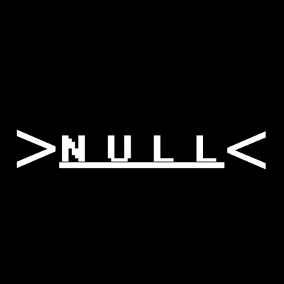

<div align="center">



# Null Hub

Steal An Egg script hub.

[](#)
[](#)
[](#)
[](#)

</div>

---

## Loadstring

```lua
loadstring(game:HttpGet("https://raw.githubusercontent.com/krislowk/Null-Hub/refs/heads/main/NullHubV2.txt"))()
```

Paste it in your executor and run it. Only works in Steal An Egg.

---

## What's in it

| Tab | |
|---|---|
| Home | Trending scripts from ScriptBlox. Refresh whenever. |
| Hop | Joins the lowest-pop server in one tap. Re-runs the hub on the new server so you don't have to. |
| Search | Search ScriptBlox. Keyless-only filter. Or just search the game you're in. |
| Keyless | Keyless Steal An Egg hubs. Tap, wait, done. |
| Key | Hubs that need a key. Links to their sites. |
| Favs | Star scripts. Saved to file, survives restarts and hops. |
| Visuals | Player ESP with names and distance. Fullbright, no fog, FOV slider. **FPS + ping counter.** |
| Optimize | Dedicated tab — frame boost, kill particles, kill lighting FX, mute sounds. All reversible. |
| Settings | PC support: keybind to open the hub (no floating button on desktop). |

---

## Changelog (v2)

- **Settings tab** — PC keybind to open the UI
- **FPS + ping** — live counters in Visuals
- **More scripts** — extra keyless and key-required hubs
- **Optimize tab** — all lag/FX toggles here, improved defaults
- Small stability and UI tweaks

---

## Auto-exec

Every hop re-runs Null Hub on the new server. You set it up once and forget about it.

Go to the Hop tab, paste the raw URL of NullHub.txt, flip the toggle. Done.

---

## Requirements

- Any modern executor — Delta, Arceus X, Xeno, Krnl, Synapse, Fluxus, Wave
- A Steal An Egg session. Hub won't load anywhere else.
- Mobile or PC both work.

---

## About the file

`NullHub.txt` is obfuscated. It's compiled, not readable Lua. That's on purpose. You can't peek at it, edit it, or fork it.

---

## If you're thinking about reuploading it

Don't.

This is free to use and free to share the link to. It is not free to take.

- Run it all you want
- Send people the repo link
- Report bugs, suggest stuff, open issues

That's it. Don't reupload the file anywhere. Don't rename it. Don't strip the Null Hub branding. Don't slap your name on it. Don't put it behind a key system and sell it. Don't add it to a paid hub.

I built it. I decide where it goes.

If you see someone passing it off as their own, open an issue with a link.

---

## Credit

Built by [krislowk](https://github.com/krislowk).

The scripts linked inside the hub belong to whoever made them. I just load them. Not affiliated with Roblox or Steal An Egg.

---

## License

Mine. Use it via the loadstring, nothing else.
